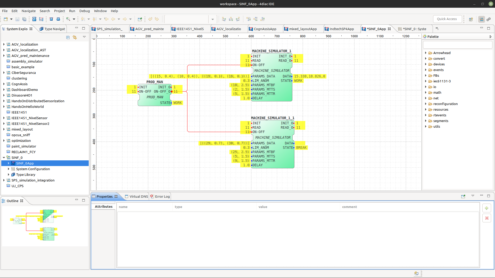
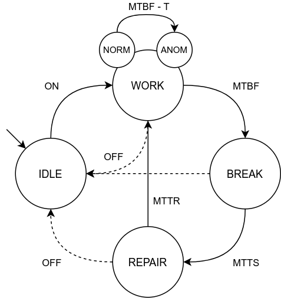
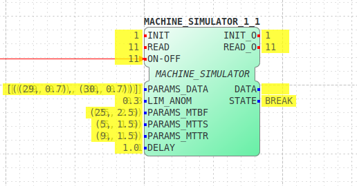
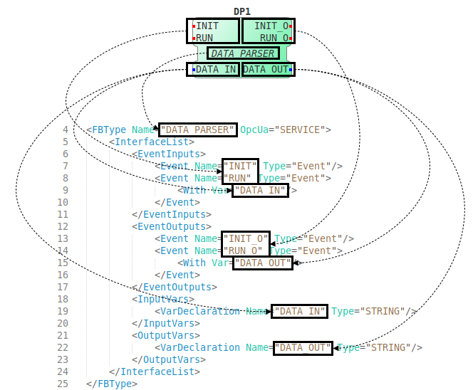
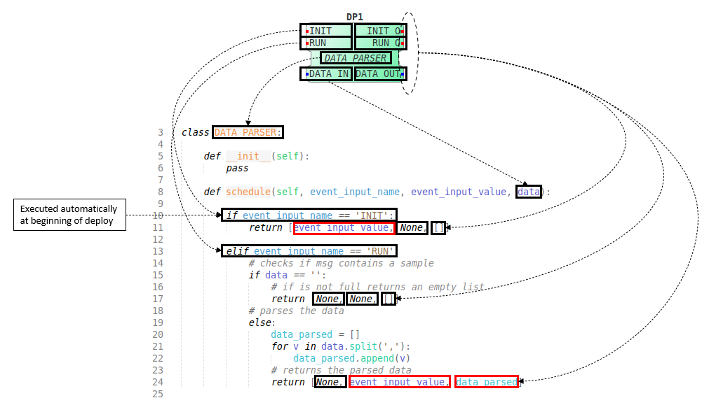
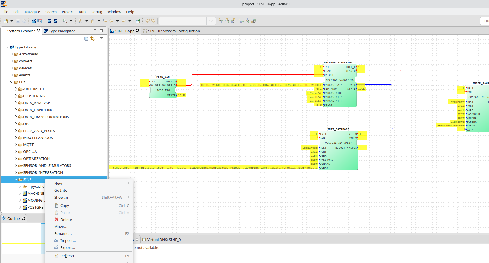
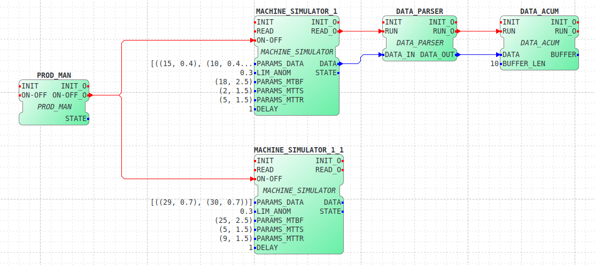

# 4DIAC-IDE

## Import project
1. This repository already provides the [template project](../template.zip) for 4DIAC-IDE.
2. Open 4DIAC-IDE, go to `File -> Import... -> Existing Projects into Workspace`. Then, choose the archive folder of the template and click Finish.

## Using the template

The general architecture contains devices, who execute a DINASORE instance, and a remote Graphical User Interface (4DIAC-IDE), where the user draw its Function Block configuration and deploys it to the network of the devices.

The following figure illustrates the starting



- **Application window**: The application window presents the function block configuration.

    Double-click `SINF_0App` on the left menu (System Explorer) to open it.

- **System configuration window**: The system configuration window shows the devices executing the DINASORE in the network or computer.

    Double-click `System Configuration` on the left menu (System Explorer) to open it.

- **Deployment window**: The function block configuration is deployed by right-clicking on the project (`SINF_0` on the left menu) and selecting deploy.

    Alternatively, you can open the deployment menu (by selecting on the top menu `Window -> Perspective -> Open Perspective -> Deployment`), and then select the project and click on Deploy.

- **Monitor system & Watch**: Monitor the function block configuration execution.

    1. Right-clicking on the project (`SINF_0` on the left menu) and selecting Monitor System.
    2. Right-click the variable/event of the function block and select Watch (the current value of the variable/event will appear in yellow);

    You can monitor the entire function block by right-clicking on the function block instead of the variable/event.

- **Trigger event**: This option sends events to a particular function block from the 4DIAC-IDE.

    You need to have a Watch active on the event you want to trigger, and after that, right-click on the event and select Trigger Event.

    You can start the simulation by triggering an event on the ON-OFF event of the PROD-MAN function block.

- **Force variable**: This option allows the modification of the value of one variable during the function execution.

    You need to have a Watch active on the variable you want to modify, and after that, right-click on the variable and write the new value.

    Experiment to change the update rate of one of the machine simulators by forcing the variable DELAY of the MACHINE_SIMULATOR function block.

## Development

The development process comprises four distinct stages:

1. Create new Function Blocks by implementing functionalities in a Python file and defining the metadata in an XML file.
2. Configure settings in the 4DIAC-IDE by dragging and dropping function blocks to represent the desired workflow.

Ultimately, you can utilize 4DIAC-IDE and Dinasore to connect your virtual system to a physical one. This integration involves mapping each function block to the corresponding equipment or device responsible for its execution, allowing you to establish a cyber-physical system. **However, within SINF, you will only develop a digital twin of a production line, focusing on simulation. Dinasore will play a crucial role in generating synthetic data that will be processed, stored, and displayed within your project.**

> Check [Dinasore's official documentation](https://github.com/DIGI2-FEUP/dinasore/wiki) for more information.

### Machine Simulator Block

Our template already provides a machine simulation block that uses a state machine like the one in the following image. The state machine has IDLE, WORK, BREAK, and REPAIR states.



The machine simulation model was implemented in a function block (FB), the MACHINE_SIMULATOR (presented at the bottom image).



**The FB simulates the machine state and generates sensorial data**, for that the user can specify the following input variables:

- **PARAMS_DATA**: This field contains the parameters used to generate machine sensor data, structured as `[((s0_norm_mean, s0_norm_std), (s0_anom_mean, s0_anom_std)), ..., ((sn_norm_mean, sn_norm_std), (sn_anom_mean, sn_anom_std))]`. Here, `sx_norm_mean` and `sx_norm_std` represent the mean and standard deviation of the sensor's normal values, while `sx_anom_mean` and `sx_anom_std` indicate the mean and standard deviation of the anomalous values. **Users can specify data for between 1 and N sensors using this nomenclature.**
- **LIM_ANOM**: This value, ranging from 0 to 1, determines when anomalous behavior in the machine begins. The start of the anomalous behavior for the sensors is calculated with the formula: `MTBF - (LIM_ANOM * MTBT)`.
- **PARAMS_MTBF**: These parameters are used to generate the time between the machine's operational and break periods. The field is structured as (`mtbf_mean`, `mtbt_std`), where `mtbf_mean` and `mtbt_std` indicate the mean and standard deviation of the distribution for mean time between failures (in seconds).
- **PARAMS_MTTS**: This field represents the parameters used to generate the time between the machine's breakdown and repair phases. It follows the structure (`mtts_mean`, `mtts_std`), where `mtts_mean` and `mtts_std` denote the mean and standard deviation of the distribution that simulates reaction time (the interval from failure to the start of repairs) (in seconds).
- **PARAMS_MTTR**: These parameters generate the time from repair to operational capacity. The structure is (`mttr_mean`, `mttr_std`), where `mttr_mean` and `mttr_std` are the mean and standard deviation of the mean time to repair distribution (in seconds).
- **DELAY**: This refers to the simulation update rate (in seconds).

### Creation of Custom Function Blocks

The development process of new Function Blocks (FBs) uses two different files:
1. Python file implementing the functionalities using the standard templates;
2. XML (.fbt) file encoding the metadata information about the FB in the form of XML tags.

#### FBT Files

The function block interface consists of two main components: **1) events** and **2) variables**, which can serve as both **inputs** and **outputs**. The key distinction between an event and a variable is that an event initiates the execution of a specific functionality, while variables are used to exchange data similarly to any standard function in Python.

Each function block can be regarded as a "module" that can be instantiated multiple times. In the FBT/XML file, you have the ability to specify both the FB Type and its category.

The Python file (TEMPLATE_FB.py) and the XML file (TEMPLATE_FB.fbt) should have the same name.

```xml
<?xml version="1.0" encoding="UTF-8" standalone="no"?>
<!DOCTYPE FBType SYSTEM "http://www.holobloc.com/xml/LibraryElement.dtd">
<FBType Name="TEMPLATE_FB" OpcUa="SERVICE">
    <InterfaceList>
        <EventInputs>
            <Event Name="INIT" Type="Event"/>
            <Event Name="RUN" Type="Event">
                <With Var="IN1"/>
            </Event>
        </EventInputs>
        <EventOutputs>
            <Event Name="INIT_O" Type="Event"/>
            <Event Name="RUN_O" Type="Event">
                <With Var="OUT1"/>
            </Event>
        </EventOutputs>
        <InputVars>
            <VarDeclaration Name="IN1" Type="STRING"/>
        </InputVars>
        <OutputVars>
            <VarDeclaration Name="OUT1" Type="STRING"/>
        </OutputVars>
    </InterfaceList>
</FBType>
```

The **SERVICE** category executes only when triggered by other function blocks. It uses just the **INIT/INIT_O** as default events for the FB initialization; the other fields can be modified as you wish.

The **DEVICE.SENSOR** category automatically executes in a loop because they need to get data from sensors or protocols continuously. For that are used two default input events (**INIT** and **READ**) and two default output events (**INIT_O** and **READ_O**); you only need to link connections in the **READ_O** event because the others are triggered automatically by the DINASORE engine.

##### Example: Data Parser Function Block




#### Python File

The second step to making a function block is encapsulating the code you develop in a Python class.

1. Replace the class name (FB_NAME) with your new function block type.
2. Implement the state machine (inside the schedule method) that checks what event was received and then executes the respective method.
3. Specify the returned attributes (output_events and output_variables) according to the order specified in the definition file.
4. Integrate the developed methods.

```python
class TEMPLATE_FB:

    def __init__(self):
        pass

    def schedule(self, event_input_name, event_input_value, input_var1):

        if event_input_name == 'INIT':
            print('initialization...')
            output_var1 = "initialized."
            return [event_input_value, None, output_var1]

        elif event_input_name == 'RUN':
            print("execution...")
            output_var1 = 'hello ' + input_var1
            return [None, event_input_value, output_var1]
```

##### Example: Data Parser Function Block



#### Files Storage

> **After implementing both files**, save them in the DINASORE function blocks directory (`resources/function_blocks/`). **DINASORE uses Docker, so we have a specific folder for transferring function block files. Place the files in `docker/data/fb` and then restart the DINASORE Docker instance.**
>
> **You also need to import the newly created blocks to 4DIAC-IDE**. Navigate to the System Explorer on the left menu, right-click `Type Library`, select the folder `Type Library/FB/SINF` and `import` both files as `General/File System`.



### Examples

On this [folder](https://github.com/DIGI2-FEUP/dinasore/tree/dinasore-lite/resources/function_blocks), inside the DINASORE-LITE branch, you can find examples of function blocks, like the data accumulator function block. (you can use the command wget to download the file)

```bash
# specify the URL to download the file
wget https://raw.githubusercontent.com/DIGI2-FEUP/dinasore/dinasore-lite/resources/function_blocks/DATA_ACUM.py
```



