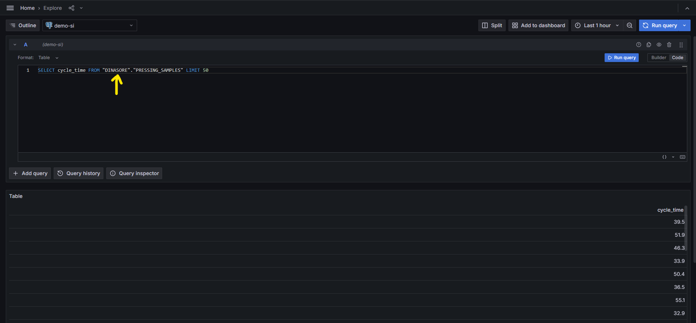

# Grafana

To deploy Dashboards with our Data we will be using a Grafana local instance.

The requirements/parameters are:

- Address: localhost
- Port: 8081
- Username: sinf
- Password: sinf

## Grafana Configuration

### Adding PostgreSQL Data Source

Creating Dashboards require data, therefore one must previously add the data source. To accomplish that:

#### 1. Frontpage

This is the main grafana front page.


#### 2. Access Data Sources

The Left tab allow us to access our Data Sources list, under the Configuration menu.


#### 3. Adding New DataSource

This page allow us to manage the added data sources and add new ones.


#### 4. Search Available Data Sources

This search page allow us to choose the supported Data Sources by Grafana. For the current application, we will be using the PostgreSQL.


#### 5. Data Source Settings

> **The figures are outdated. Use the following connection parameters.**

The main settings to add/change:

- Data Source Name
- PostgreSQL Connection
    ```python
    {
        "host": "postgres",
        "database name": "sinf",
        "username": "sinf",
        "password": "sinf"
    }
    ```

Then, after clicking the Save & Test button, the data source is ready to be used (if the message "Database Connection OK" appears).


#### 6. Checking Data Sources List

If the Data Source was successfully added it should be visible in the Data Sources List (under the configuration menu on the left tab).


The full steps are portrayed below:


### Exploring the Data Source

Before creating one dashboard, it could be useful to check if Grafana is being able to extract the data from our DataBase.

#### Access to Explorer

We explore the Data Source by clicking the Explore button.


#### Testing Query

To execute some query, follow the steps:

1. Select the desired output format (table, time series, etc);
2. Build the query with the Query Editor

> *Example*: query the database and display the column "carriage_speed" values


#### Solving "No Data"

No data is retrieved. This usually happens due to the fact that Grafana usually sets automatically the highest search path. The workaround for this is to Edit the Query and add the schema.

> *Example*: the table "PRESSING_SAMPLES" would be replaced by "DINASORE"."PRESSING_SAMPLES" being "DINASORE" our schema.

By accessing the code tab we can edit the Queries:


And, after adding the schema it results:




### Creating Dashboard

#### 1. Selecting a Data Source

The button "Build a Dashboard" quickly selects the desired data source to be used on the dashboard we want to create.


#### 2. Adding a Panel

Dashboards may have a variety of elements. To start adding the first element, we can choose "Add a new Panel".


#### 3. Building Queries

This page allow us to configure our dashboard element. As for the data to be visualized, we build queries with the Query Editor which will provide the data.


#### 4. Query Example

For this example, the objective is to plot the average of all the columns of the last 50 rows.

With the following SQL it is possible to accomplish that:

```sql
SELECT
    timestamp,
    high_pressure_input_time,
    lower_plate_temperature,
    lowering_time
FROM
  (SELECT * FROM "DINASORE".pressing_samples ORDER BY timestamp DESC);
```

Since this code has more complexity, it is preferred to write it on the code Editor instead of using the Query Editor/Builder.


With 5000 pressing samples (change to `LIMIT 5000`):

#### 5. Saving the Dashboard

After adding our queries and configuring our Dashboard we apply the changes to save it.


Checking our panel:


Saving the Dashboard:


#### 6. Multiple Queries

It is also possible to have multiple queries on the same dashboard element.


The queries used above are:

```sql
SELECT
  timestamp,
  lower_plate_temperature as "Lower Plate Temperature"
FROM "DINASORE".pressing_samples ORDER BY timestamp DESC LIMIT 500;

SELECT
  timestamp,
  high_pressure_input_time as "High Pressure Input Time"
FROM "DINASORE".pressing_samples ORDER BY timestamp DESC LIMIT 500;

SELECT
  timestamp,
  lowering_time as "Lowering Time"
FROM "DINASORE".pressing_samples ORDER BY timestamp DESC LIMIT 500;
```
