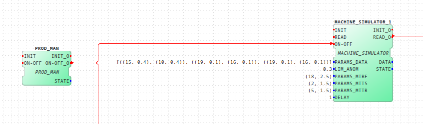
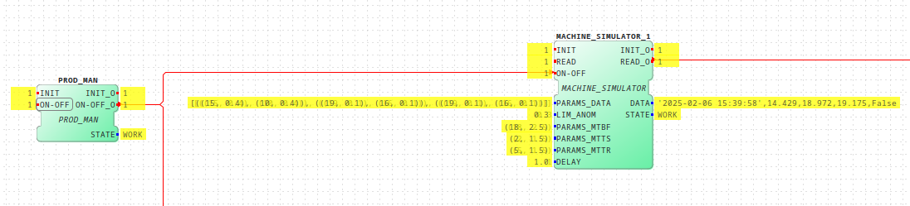
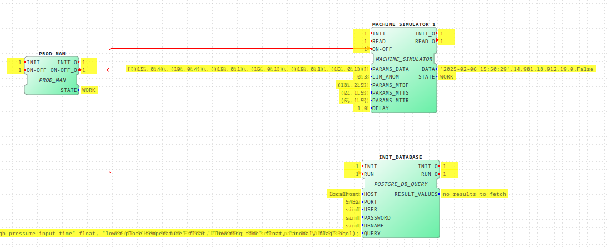
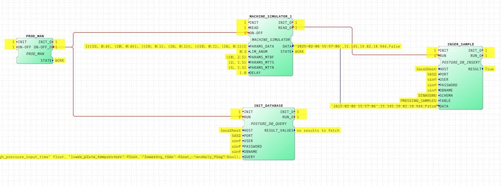

# PostgreSQL

## Database Parameters

You will use our local instance of PostgreSQL. The connection parameters are:

- **Database name**: sinf
- **Username**: sinf
- **Password**: sinf
- **Host**: localhost
- **Port**: 5432

## Example

In this tutorial, we will demonstrate how to use 4diac-ide to send simulated sensor data to a PostgreSQL database.

### Data Format

The data will be stored in a single table that contains the following columns. Below is a sample of the data:

```python
{
    "timestamp": "2024-04-09 12:46:58",
    "highPressureInputTime": 10.812,
    "lowerPlateTemperature": 188.382,
    "loweringTime": 20.662,
    "anomalyFlag": False
}
```

To generate data, we will utilize `MACHINE_SIMULATOR` blocks. **See the [4diac-ide tutorial](4diac-ide.md) for guidance on its parameterization.**



Configure the block to generate data for three sensors, as illustrated in the figure. The Machine Simulator block is designed to prepend the timestamp and append the anomaly flag. By monitoring the variable, you can observe the sample outputs.




#### Creating Table

Before creating the table to store our sensor data, we first need to establish and associate it with a schema. To create a schema, use the following SQL statement:

```sql
CREATE SCHEMA IF NOT EXISTS "DINASORE";
```

Once the schema is created, be sure to set the search path to your project's schema with the following command:

```sql
SET SEARCH_PATH TO DINASORE;
```

The **search_path** variable defines the order in which database schemas are searched for objects. To apply this, simply prepend the SQL statement as demonstrated in the snippets below.

To create the required table (`PRESSING_SAMPLES`), execute the following SQL statement, ensuring that you specify the necessary columns and their data types:

```sql
SET SEARCH_PATH TO DINASORE; CREATE TABLE IF NOT EXISTS PRESSING_SAMPLES ("id" serial primary key, "timestamp" timestamp, "high_pressure_input_time" float, "lower_plate_temperature" float, "lowering_time" float, "anomaly_flag" boolean);
```

Database initialization involves creating all essential schemas, tables, and relationships. In **4diac-ide**, we will utilize the `POSTGRE_DB_QUERY` block as shown below. In this block, you’ll need to enter the database parameters and the query that will be executed in your database. We will use the previously demonstrated query to create our table.



#### Populate

To insert a single sample into our table, use the following SQL statement:

```sql
INSERT INTO PRESSING_SAMPLES (timestamp, high_pressure_input_time, lower_plate_temperature, lowering_time, anomaly_flag) VALUES (%s,%s,%s,%s,%s);
```

If you don’t want to name the columns for each insert, you can use a different SQL statement. It’s important to provide a unique primary key (id). You can also use the **DEFAULT** keyword, which lets PostgreSQL automatically increase the index.

```sql
INSERT INTO PRESSING_SAMPLES VALUES (DEFAULT,%s,%s,%s,%s,%s);
```

To insert data samples into our database, we have developed the `POSTGRE_DB_INSERT` block, as illustrated below. For more details, please refer to the implementation available in [docker/data/fb](docker/data/fb).




### Helper (Python) Functions to interact with the DB

To accelerate your development, we provide a [helper class](../scripts/db.py) which you can use to:

- initialize/create database schema/table
- delete the database schema/table
- insert data

